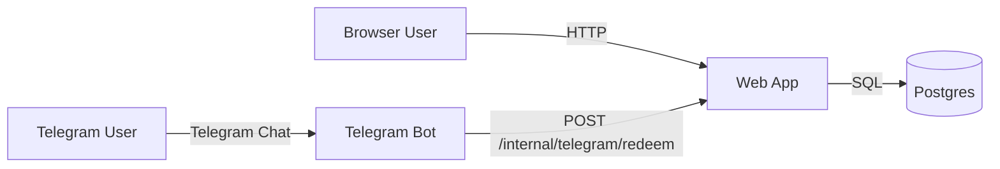
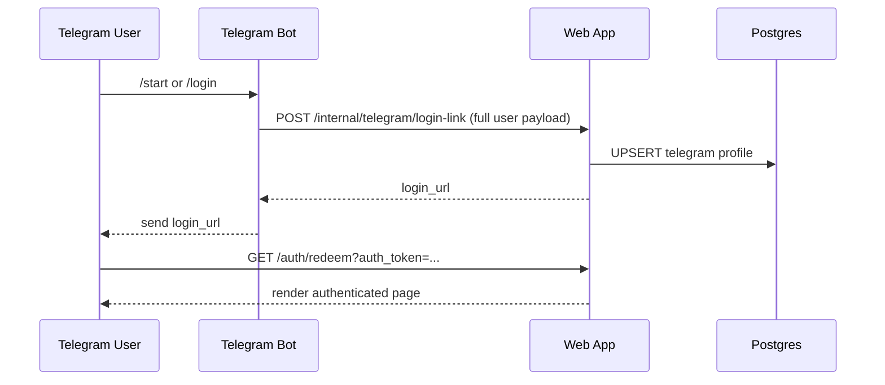

# simple-service-with-auth

Minimal example application for `msgr-authkit` with:
- web app (Go)
- Telegram bot (Go)
- Postgres

Everything runs from one `docker-compose.yml`. Only auth flow is implemented.
Implementation uses:
- `gorm` (Postgres ORM)
- `telebot` (Telegram SDK)

## Architecture



## Login Sequence



## Run

1. Create env file:

```bash
cd examples/simple-service-with-auth
cp .env.example .env
```

2. Fill `.env`:
- `TELEGRAM_BOT_TOKEN` (required)
- `BOT_USERNAME` (recommended for clickable deep link)
- `INTERNAL_API_TOKEN` (shared secret between bot and web)
- `WEB_PORT` (web app port, default `8080`)

3. Build all custom services:

```bash
docker compose build
```

4. Start everything:

```bash
docker compose up
```

5. Open bot in Telegram, send `/start` (or `/login`), open the returned login link.
6. Open the login link and you will see authenticated profile data.

## Notes

- Postgres uses the official image; web and bot are built via `docker compose build`.
- Login link redemption is one-time (intent-based) and no persistent web session is kept in this minimal example.
- Internal bot -> web endpoint is protected by `INTERNAL_API_TOKEN`.
- The bot forwards rich Telegram user fields (id, username, names, language, premium/capability flags), and the web app stores/displays them after login.
